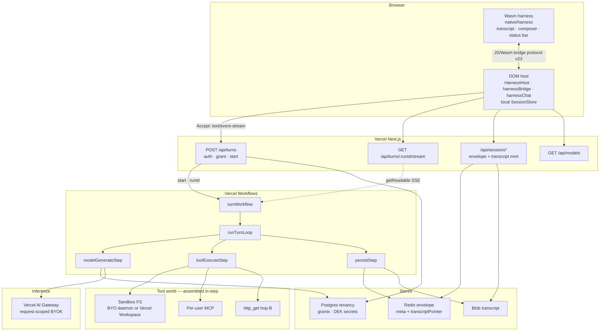

# Architecture

How Invincible is put together: a **Wasm harness** in the browser, a thin **DOM
host**, and a **Vercel** backend that runs durable turns on **Workflows**.

Ownership of UI vs host vs API is in [feature-divide.md](feature-divide.md). This
page is the system map those docs sit on.

## Overview

Wasm is the product surface. The DOM host loads it, polls the bridge, and talks
to HTTP. Workflows owns the turn. Wasm never talks to Redis, Blob, Gateway, or
the sandbox.

## Layers

| Layer | What it is | What it is not |
|-------|------------|----------------|
| **Wasm harness** | Transcript, composer, status bar, keymap, live tool-run / thinking paint | Storage, inference, secrets |
| **DOM host** | `/harness` shell: load `web.js` + `harness.wasm`, bridge poll/submit, local `SessionStore`, cloud session I/O | A React chat panel |
| **Next.js routes** | Auth, body, BYOK/grant gates, `start(turnWorkflow)`, session APIs | The agent loop |
| **Workflows** | One run = one prompt. Loop calls `modelGenerateStep`, `toolExecuteStep`, `persistStep` | A single step wrapping `runAgentStream` |
| **Stores** | Redis = small envelope. Blob = transcript. Postgres = tenancy, grants, DEK ciphertext | Secrets inside session blobs |
| **Gateway** | Request-scoped BYOK for the authorized `modelId` | Host env-model fallback |
| **Tools** | Sandbox FS, per-user MCP, builtin `http_get`, in-process skill/meta tools | The Zig GHA compile runner |

## Durable turn

Production host submit is `POST /api/turns` with `Accept: text/event-stream`. The
route authenticates, requires `sessionId`, resolves tenant BYOK, then
`start(turnWorkflow, …)` with **serializable args only** (prompt, `modelId`,
scope, bind). It never passes a tools dict, API keys, or closures. `turnRunId` is
the Workflow run id, not the session id. Fail-closed `start` throw is **503** —
never a silent `/api/agent` fallback.

`turnWorkflow` (`"use workflow"`) runs `runTurnLoop`. Each `'use step'`
re-resolves its world from `scope`:

| Step | Does | Live SSE |
|------|------|----------|
| `modelGenerateStep` | One LLM round (`generateOneRound`). Schemas only. BYOK + `resolveSystem` in-step | `reasoning_delta` / `text_delta` / `tool_start` — one held writer |
| `toolExecuteStep` | One batch = that round's `toolCalls`. Same `assembleDurableToolWorld` | `tool_result` — one held writer for the batch |
| `persistStep` | Blob transcript segment + Redis envelope overlay | None. Persist `{ok:false}` does **not** fail the turn |

The `'use workflow'` orchestrator cannot write the stream. `done` / `error` are
loop-owned (`writeTurnSse`). Event types match [agent-stream.md](agent-stream.md).
Leave-tab abort is **detach**: the run keeps going; `GET /api/turns/:runId/stream`
reattaches via `getReadable`.

Host `runHarnessTurn` uses `/api/turns` only. `POST /api/agent` stays reachable
as the **legacy tests/JSON** inject path (`sendAgent` / `sendAgentStream`).
`POST /api/chat` is single-shot inference, not the harness turn.

## Persist

| Store | Holds | Who writes |
|-------|-------|------------|
| **localStorage** | First-paint snapshot | DOM host. Wasm never touches it |
| **Redis envelope** | Small meta: `transcriptPointer`, `logicalCwd`, `activeSandboxId`, `turnRunId`, selected model | Host `/api/sessions` upserts; `persistStep` overlays live turn keys |
| **Blob** | Transcript object chain (`messages`, optional `prev` / `depth` / `queue`) | Host terminal PUT may flatten; worker persist writes this-run chunks |
| **Postgres** | Users, tenants, sandbox catalog/grants, BYOK + MCP ciphertext under tenant DEK, personas, skills | Admin / Settings / first-run sign-up. Not the transcript |

Envelope-only boot can overlay a still-`running` `turnRunId` when the Blob object
is missing. Reconstruct walks `prev` (cap 256). Details:
[session-model.md](session-model.md).

## Inference (BYOK / Gateway)

Admin `/admin/inference` stores provider secrets under the tenant DEK and grants
model ids. `GET /api/models` is the catalog the host pushes into the Wasm status
bar. At submit the host sends the live Wasm `modelId`; the turns route and
`modelGenerateStep` **re-authorize** that id and attach request-scoped Gateway
BYOK. They never call `streamText` with a bare id from host env.

Vercel AI Gateway may resolve the **same** model id to different upstreams
(for example Together vs Fireworks). That is Gateway routing, not a second
in-repo model catalog.

## Tools and sandbox

`assembleDurableToolWorld` (shared by model + tool steps) builds the same surface
as the legacy agent route: sandbox FS (`list_dir` / `read_file` / `write_file` /
`str_replace` / `exec` / `search` / `change_dir`), optional `http_get`, enabled
per-user MCP, and in-process `meta_*` / skill tools. Hard grant-deny is **403**.
Missing workspace with HTTP/MCP still usable is a soft continue.

The **sandbox** is a jailed tools workspace (BYO protocol-v2 daemon **or** a user
Vercel Workspace instance, attach-only). It is **not** the self-hosted Zig
runner that compiles `native/harness` ([runner.md](runner.md),
[sandbox.md](sandbox.md)). MCP keys and GitHub PATs stay server-side under the
DEK ([mcp.md](mcp.md)).

## Off this diagram

| Piece | Where |
|-------|-------|
| Login wall, `/admin`, `/settings` | DOM + Postgres. Configure grants, MCP, sandbox instances — not the turn loop |
| `POST /api/agent` | Tests / JSON inject. Same event types; not the production host path |
| `POST /api/workflows/smoke` | Workflows enablement check. Never a fallback to `/api/agent` |
| GHA `build-harness` | Zig → Wasm artifact → Vercel. Separate from agent tools |
| Slash-command `/skill-name` attach | Legacy `/api/agent` path. Durable step re-resolves sticky / always-on skills only |

## Key paths

| Concern | Path |
|---------|------|
| Host shell | `app/harness/HarnessHost.tsx`, `lib/harnessChat.ts`, `lib/harnessBridge.ts` |
| Wasm UI + bridge | `native/harness/src/{ui,bridge}.zig` |
| Durable start | `app/api/turns/route.ts` |
| Reattach | `app/api/turns/[runId]/stream/route.ts` |
| Workflow entry + loop | `lib/workflows/turnWorkflow.ts`, `lib/workflows/turnLoop.ts` |
| Steps | `lib/workflows/{modelGenerateStep,toolExecuteStep,persistStep}.ts` |
| Tool world | `lib/workflows/assembleDurableToolWorld.ts` |
| BYOK | `lib/tenancy/resolveInference.ts`, `lib/gateway/byokProviders.ts` |
| Session stores | `lib/sessions/*`, `lib/tenancy/harnessSessionsRedis.ts` |
| Composition root | `lib/di/index.ts` |

## Related

- Feature divide (who owns UI): [feature-divide.md](feature-divide.md)
- SSE events and turn-end: [agent-stream.md](agent-stream.md)
- Envelope + Blob: [session-model.md](session-model.md)
- Agent tools workspace: [sandbox.md](sandbox.md)
- Builtin HTTPS: [builtin-http.md](builtin-http.md)
- Per-user MCP: [mcp.md](mcp.md)
- BYO Vercel + keys: [bring-your-own.md](bring-your-own.md)
- Zig compile runner: [runner.md](runner.md)
- Visitor front door: [README](../README.md)
